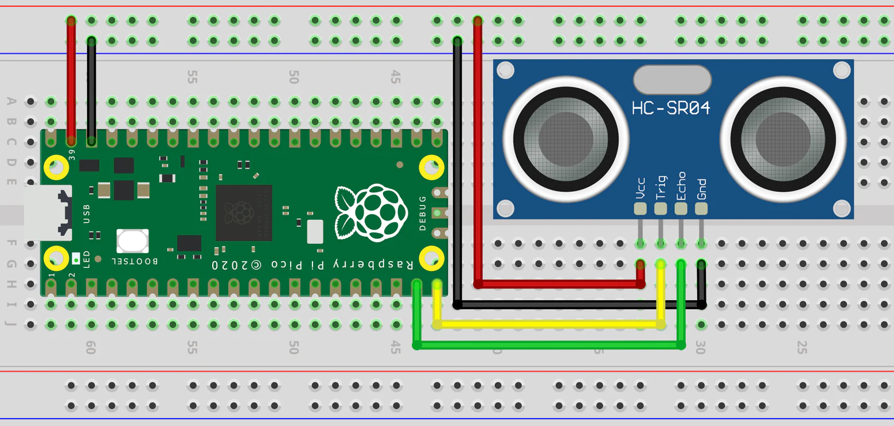
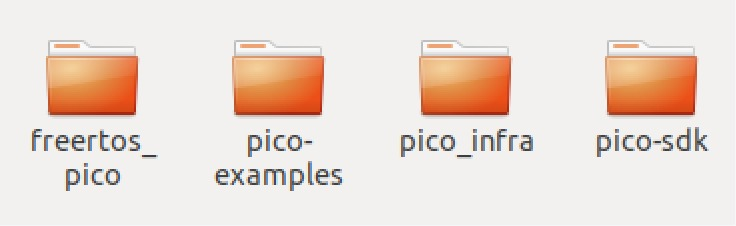
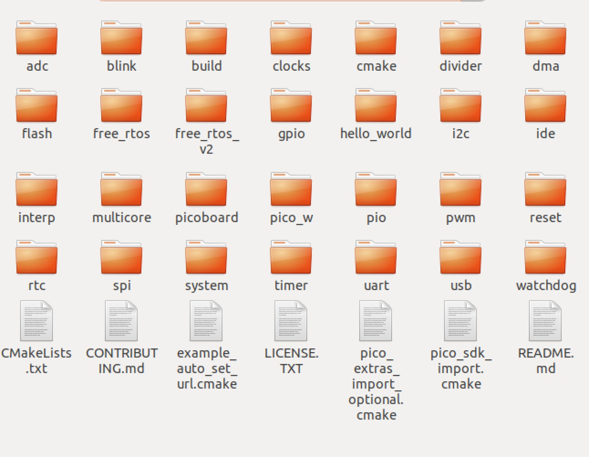
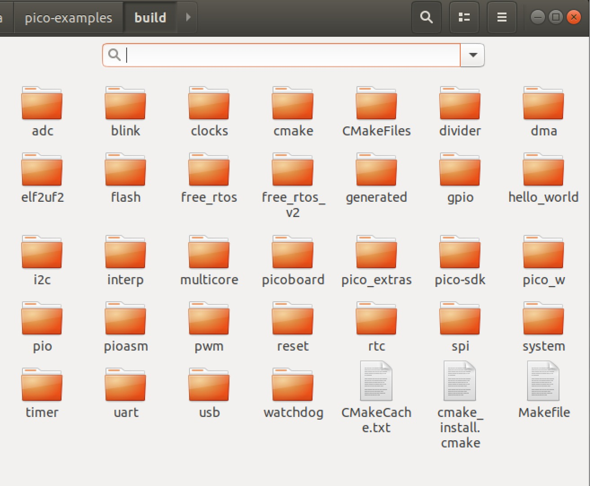

# Instalando infra necessária para usar FreeRTOS com Raspberry Pi Pico W e exemplo com sensor ultrassônico

- **Alunes:** Daniel Minson Pucciariello
- **Curso:** Engenharia da Computação
- **Semestre:** 10
- **Contato:** danielp6@al.insper.edu.br
- **Ano:** 2023

## Começando

Para seguir esse tutorial é necessário:

- **Hardware:** Raspberry Pi PICO
- **Softwares:** FreeRTOS
- **Documentos:** [Getting Starter with Pico Development](https://datasheets.raspberrypi.com/pico/getting-started-with-pico.pdf)

## Motivação
Como engenheiro recém-formado, compartilho um tutorial prático sobre programar a Raspberry Pi Pico com FreeRTOS. Este recurso abrangente explora desde a configuração inicial até a implementação de tarefas concorrentes, capacitando os desenvolvedores a criar projetos eficientes e inovadores. 

Descubra as vastas possibilidades da programação embarcada com FreeRTOS na Raspberry Pi Pico!

## Baixar arquivo de setup
1. wget https://raw.githubusercontent.com/raspberrypi/pico-setup/master/pico_setup.sh
2. chmod +x pico_setup.sh
3. ./pico_setup.sh


!!! note 
    Tenha certeza que o seu cmake é pelo menos 3.12 usando `cmake --version`

    Caso contrario, é necessario desinstalar e instalar um novo
    

## Como instalar um novo cmake?
1. `sudo apt remove cmake`
2. baixe em https://cmake.org/download/ a versao mais nova do cmake estável
3. copie para a pasta /opt/
4. rode:`sudo bash /opt/cmake-3.*your_version*.sh`
5. crie um link simbolico (fazendo as devidas substituições ) `sudo ln -s /opt/cmake-3.*your_version*/bin/* /usr/local/bin`
6. teste com: `cmake --version`


**Referência:** [Askubuntu](https://askubuntu.com/questions/829310/how-to-upgrade-cmake-in-ubuntu)


!!! note 
    É necessário ter um módulo que chama **raspi-config**, que pode ser que não esteja instalado. 

    rode `sudo raspi-config` para ver se está instalado, caso nao esteja, rode o seguinte script para instalacao (presente nesse [github](https://github.com/EmilGus/install_raspi-config))

## Como instalar um raspi-config?¶

1. wget https://github.com/EmilGus/install_raspi-config/blob/master/install.sh
2. chmod +x install.sh
3. ./install.sh 

**Referência**: [Rootsaid](https://rootsaid.com/raspi-config-install-setup-in-any-raspberry-pi-linux-os/)

## Libusb
- muito provavelmente você vai ter que instalar essa biblioteca:

`sudo apt-get install libusb-1.0-0-dev`

!!! warning
    obs: se aparecer um erro durante o setup do arquivo `pico_setup.sh`, vc precisa apagar a pasta onde vc estava rodando o setup antes de rodar pico_setup.sh novamente.

## Como instalar toolchain:

sudo apt update
sudo apt install cmake gcc-arm-none-eabi libnewlib-arm-none-eabi build-essential

## Como instalar sdk e exemplos:
1. git clone https://github.com/raspberrypi/pico-sdk.git --branch master
2. cd pico-sdk
3. git submodule update --init
4. cd ..
5. git clone https://github.com/raspberrypi/pico-examples.git --branch master

# Compilação
Para realizar a compilação, o sdk precisa estar com o export path configurado.

Isso pode ser feito configurando uma variavel no bash_rc ou de forma manual todas as vezes que você abrir o terminal.


`export PICO_SDK_PATH=/media/soc/rtos_pico_infra/pico-sdk`

ou 

`gedit .bashrc e ai definir PICO_SDK_PATH=/media/soc/rtos_pico_infra/pico-sdk`

1. crie uma pasta “build” dentro da pasta “pico_examples” e mude para esse diretorio


2. Rode o comando para realizar a criação de todas as pastas de compilação (desde que estejam no arquivo `CmakeLists.txt`): 
`cmake ..` -> compila os projetos do diretorio superior na pasta atual.

Agora sempre que você quiser compilar um programa, você precisa ir na sua pasta correspondente dentro da pasta “build” e ai rodar o comando *“make”* no terminal. 

!!! warning
    Caso você altere algum arquivo `CmakeLists.txt` ou semelhante de algum projeto, o comando *"cmake"* precisa ser refeito na raiz da sua pasta de projetos antes de realizar comandos *"make"*. As vezes é necessário apagar todos os componentes da pasta build.


!!! note 
    o arquivo CMakeLists.txt na raiz da pasta de exemplos (ou da pasta que você tiver projetos), precisa ser atualizado para adicionar pastas para serem compiladas, por exemplo com a pasta “free_rtos”:

    `add_subdirectory(free_rtos)`

```c
cmake_minimum_required(VERSION 3.12)

# Pull in SDK (must be before project)
include(pico_sdk_import.cmake)

include(pico_extras_import_optional.cmake)

project(pico_examples C CXX ASM)
set(CMAKE_C_STANDARD 11)
set(CMAKE_CXX_STANDARD 17)

if (PICO_SDK_VERSION_STRING VERSION_LESS "1.3.0")
    message(FATAL_ERROR "Raspberry Pi Pico SDK version 1.3.0 (or later) required. Your version is ${PICO_SDK_VERSION_STRING}")
endif()

set(PICO_EXAMPLES_PATH ${PROJECT_SOURCE_DIR})

# Initialize the SDK
pico_sdk_init()

include(example_auto_set_url.cmake)
# Add blink example
add_subdirectory(blink)

# Add hello world example
add_subdirectory(hello_world)

add_compile_options(-Wall
        -Wno-format          # int != int32_t as far as the compiler is concerned because gcc has int32_t as long int
        -Wno-unused-function # we have some for the docs that aren't called
        )
if (CMAKE_C_COMPILER_ID STREQUAL "GNU")
    add_compile_options(-Wno-maybe-uninitialized)
endif()

add_subdirectory(free_rtos_v2)

```


# **Como subir um código para a placa raspiberry pi pico?**

### Forma 1: 
Copiar o arquivo com extensao .uf2 para dentro do armazenamento da pico.

Obs: a placa precisa estar em modo de download. Para isso, conecte a placa com o computador segurando o botao de boot.


# RTOS
Existe um [GitHub](https://github.com/TechieLew/Using-FreeRTOS-with-the-Raspberry-Pi-Pico/tree/main) onde há 2 arquivos imprescindíveis para colocar na pasta que vc for criar programas com freeRTOS (incluindo a biblioteca). Não esquecer de colocar a pasta no arquivo CMakeLists.txt na raiz da pasta onde estao os seus projetos.

### Necessário clonar o Kernel do FreeRTOS na sua pasta principal de infra.
Para isso rode o comando: `git clone -b smp https://github.com/FreeRTOS/FreeRTOS-Kernel --recurse-submodules`

[Referência](https://embeddedcomputing.com/technology/open-source/linux-freertos-related/using-freertos-with-the-raspberry-pi-pico)

`export FREERTOS_KERNEL_PATH=/media/soc/rtos_pico_infra/freertos_pico/FreeRTOS-Kernel`

ou 

`gedit .bashrc e ai definir export FREERTOS_KERNEL_PATH=/media/soc/rtos_pico_infra/freertos_pico/FreeRTOS-Kernel`


# **Arquivo CMakeLists**
!!! Cuidado 
    CMakeLists.txt precisa ser alterado sempre que você faz um novo projeto.


Supondo um arquivo CMakeLists.txt para o projeto “free_rtos“, fica assim:
```c
cmake_minimum_required(VERSION 3.13)

# Pull in SDK (must be before project)
include($ENV{PICO_SDK_PATH}/external/pico_sdk_import.cmake)

# Pull in FreeRTOS
include($ENV{FREERTOS_KERNEL_PATH}/portable/ThirdParty/GCC/RP2040/FreeRTOS_Kernel_import.cmake)

project(app C CXX ASM)
set(CMAKE_C_STANDARD 11)
set(CMAKE_CXX_STANDARD 17)

# Initialize the SDK
pico_sdk_init()

add_executable(free_rtos main.c)

target_include_directories(free_rtos PRIVATE ${CMAKE_CURRENT_LIST_DIR})
 
# pull in common dependencies
target_link_libraries(free_rtos pico_stdlib FreeRTOS-Kernel FreeRTOS-Kernel-Heap4)

# create map/bin/hex/uf2 file etc.
pico_add_extra_outputs(free_rtos)
```

Supondo que vc queira usar a porta serial para prints ou coisas semelhantes:
```
# enable usb output, disable uart output
pico_enable_stdio_usb(hello_usb 1)
pico_enable_stdio_uart(hello_usb 0)
```


# **Exemplo de fila no FreeRTOS - HCSR04**
O código abaixo é um programa em C projetado para medir a distância usando um sensor de ultrassom HC-SR04 em um Raspberry Pi Pico. A aplicação utiliza o FreeRTOS, um sistema operacional em tempo real, para gerenciar tarefas concorrentes.


Esquemático:


Código em C:
=== "C"
    ``` c
    #include <stdio.h>
    #include <stdint.h>
    #include "pico/stdlib.h"
    #include "pico/time.h"
    #include "hardware/gpio.h"
    #include "FreeRTOS.h"
    #include "task.h"
    #include "queue.h"

    #define TRIGGER_PIN 15
    #define ECHO_PIN 14

    QueueHandle_t distanceQueue;

    void echoInterrupt(uint gpio, uint32_t events);

    void triggerSensor();

    void distanceTask(void *pvParameters);

    int main() {
        stdio_init_all();
        sleep_ms(10000);
        printf("Está rodando\n");
        sleep_ms(1000);

        // Initialize HC-SR04 pins and FreeRTOS queue
        gpio_init(TRIGGER_PIN);
        gpio_set_dir(TRIGGER_PIN, GPIO_OUT);
        gpio_init(ECHO_PIN);
        gpio_set_dir(ECHO_PIN, GPIO_IN);

        distanceQueue = xQueueCreate(5, sizeof(uint32_t));
        if (distanceQueue == NULL) {
            printf("Error creating queue.\n");
            // Handle the error
        }

        // Set up interrupt for both rising and falling edges
        gpio_set_irq_enabled_with_callback(ECHO_PIN, GPIO_IRQ_EDGE_RISE | GPIO_IRQ_EDGE_FALL, true, &echoInterrupt);

        // Create the distance processing task
        xTaskCreate(distanceTask, "DistanceTask", configMINIMAL_STACK_SIZE, NULL, tskIDLE_PRIORITY + 1, NULL);

        // Start FreeRTOS scheduler
        vTaskStartScheduler();

        return 0;
    }

    void echoInterrupt(uint gpio, uint32_t events) {
        static uint32_t startTime;
        static uint32_t endTime;

        uint32_t time = time_us_32();

        if (events & GPIO_IRQ_EDGE_RISE) {
            startTime = time;
            // printf("Rising Edge Interrupt\n");
        } else if (events & GPIO_IRQ_EDGE_FALL) {
            endTime = time;
            // Calculate delta T
            uint32_t deltaTime = endTime - startTime;

            // Send delta T to the queue
            xQueueSendFromISR(distanceQueue, &deltaTime, NULL);

        }

        // Re-enable the interrupt for both rising and falling edges
        gpio_acknowledge_irq(ECHO_PIN, events);
        gpio_set_irq_enabled_with_callback(ECHO_PIN, GPIO_IRQ_EDGE_RISE | GPIO_IRQ_EDGE_FALL, true, &echoInterrupt);
    }

    void triggerSensor() {
        // Trigger the HC-SR04 by pulsing the trigger pin
        gpio_put(TRIGGER_PIN, 1);
        sleep_us(10);  // Pulse width must be at least 10 us
        gpio_put(TRIGGER_PIN, 0);
    }

    void distanceTask(void *pvParameters) {
        uint32_t distance;
        const TickType_t xDelay = pdMS_TO_TICKS(1000);  // Trigger every 1000 ms (1 second)
        while (1) {
            // Trigger the sensor periodically
            triggerSensor();
            
            if (xQueueReceive(distanceQueue, &distance, portMAX_DELAY)) {
                // Process the distance or do any other task
                printf("Distance: %.2f cm\n", distance * 0.0343 / 2); // Convert to centimeters
            } else {
                printf("Deu errado\n");
            }
            vTaskDelay(xDelay);
        }
    }
    ```


A estrutura do programa começa com a configuração dos pinos GPIO para se conectar ao sensor e a inicialização de uma fila FreeRTOS chamada `distanceQueue`. Esta fila é fundamental para armazenar os tempos de eco medidos pelo sensor.

Uma função de interrupção, `echoInterrupt`, é configurada para lidar com eventos no pino de eco do sensor. Ela registra os tempos de início e fim do pulso de eco e envia a diferença para a fila `distanceQueue`. Essa abordagem assíncrona permite que a tarefa principal (`distanceTask`) processe os tempos de eco de maneira eficiente, sem bloqueios desnecessários.

A tarefa `distanceTask` é responsável por acionar periodicamente o sensor, chamando a função `triggerSensor`. Após acionar o sensor, ela aguarda a recepção dos tempos de eco na fila `distanceQueue`. Quando os dados são recebidos, a tarefa processa as informações, calcula a distância e exibe o resultado convertido em centímetros.

A fila desempenha um papel crucial no sincronismo entre a interrupção e a tarefa principal, garantindo que os dados sejam transferidos de maneira organizada e eficaz. Isso é particularmente útil em sistemas embarcados e multitarefa, onde a coordenação de eventos assíncronos é essencial.

Em resumo, o código exemplifica a utilização de filas em um contexto de medição de distância, proporcionando uma abordagem eficiente e organizada para lidar com dados assíncronos provenientes de um sensor de ultrassom em um ambiente de sistemas embarcados.


# Organização de pastas
Pasta da infraestrutura:

{width=500}

Pasta examples:

{width=500}

Pasta build:

{width=500}


